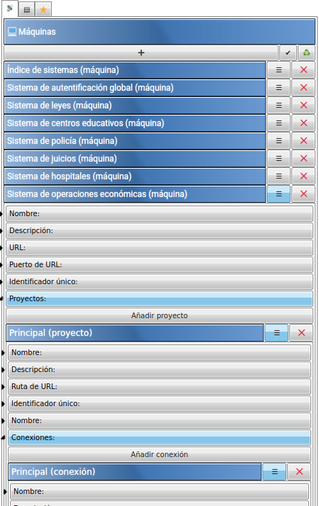

# Constructor de bases de datos de Castelog

Construcción de esquemas e infraestructuras de datos.

## Versión online

Puedes acceder a la versión online en:

*[https://allnulled.github.io/constructor-de-bases-de-datos-de-castelog](https://allnulled.github.io/constructor-de-bases-de-datos-de-castelog)*

## Instalación

**Paso 1**. Abre un directorio limpio, clona este proyecto e instala las dependencias.

```sh
mkdir directorio-limpio
cd directorio-limpio
git clone https://github.com/allnulled/constructor-de-bases-de-datos-de-castelog.git .
npm install
```

**Paso 2**. Arranca el servidor de test que nos sirve la aplicación de *Constructor de bases de datos de calo*.

```sh
npm test
```

**Paso 3**. Abre el navegador por la URL que aparece en consola, y luego la aplicación html.

## ¿Para qué sirve?

El «Constructor-de-bases-de-datos-de-calo» es:
  - una interfaz web de usuario
  - destinada a crear documentos que:
    - sirven para representar infraestructuras de datos
      - que acepta múltiples máquinas
      - que acepta múltiples proyectos por máquina
      - que acepta múltiples conexiones de bases de datos por proyecto
    - sirven para representar esquemas de bases de datos
      - que acepta múltiples tablas
      - que acepta múltiples columnas por tabla
      - que acepta múltiples atributos extra por columna o tabla
  - mediante (100%) interacción gráfica + (0%) scripting
  
Una web para crear diseños de sistemas de datos distribuidos. Pero solo saca un fichero JSON. Luego ese fichero puede utilizarse en otras aplicaciones que quieran usarlo.

## Uso

El apartado de infraestructura es para el que quiere organizar los datos en diferentes máquinas. Se presupone que pueden existir varios proyectos por máquina, y varias conexiones de datos por proyecto.

El apartado de esquema es para definir la forma de los datos que queremos gestionar. Tablas, columnas y atributos correspondientes.

El apartado de descargar sirve para exportar en formato `json` el diseño de todo: infraestructura y esquema.

## ¿Por qué si ya existen tropocientas?

Este software solo genera un JSON. Muchos softwares generan un JSON.

Pero la idea es poder representar las bases de datos sin límites de extensión. Por ejemplo, una red de computadoras al servicio de un *Estado digitalizado* donde el papel-moneda o la anonimidad económica, ya no son posibles, podría empezarse así, separando cada temática de estado:




## Licencia

Legal y regalada debería ser, para todo el que la quiera.